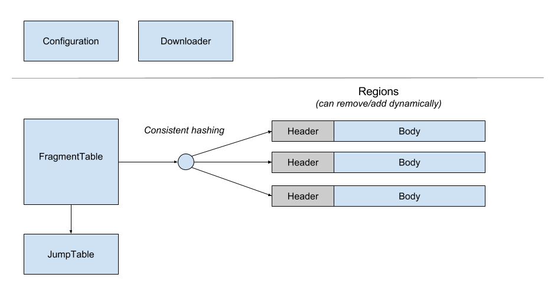
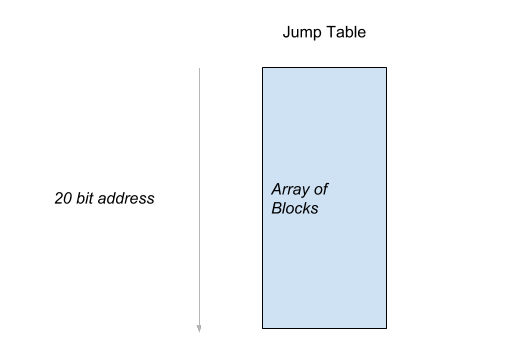

Catchy
=============



### 1. Configuration
```js
{
    "version": "1.0.0",
    "regions": {
        // 12 types of regions
        // users can manually add/remove regions at runtime
        // for example, via command:
        // $ catchy_ctl reload
        // max size: 16gb
        "1kb": [{
                // Path to our director cache
                // If it does NOT exist, it"s gonna be created.
                "path": "/media/sdb1/cache/1kb",
                "size": "16gb"
            },
            {
                "path": "/media/sdb2/cache/1kb"
                    // if no `size` is specified, the maximum one will be used
            }
        ],

        // max size: ~33gb
        "2kb": [

        ],

        // max size: ~64gb
        "4kb": [

        ],

        // max size: ~128gb
        "8kb": [

        ],

        // max size: ~256gb
        "16kb": [

        ],

        // max size: ~512gb
        "32kb": [],

        // max size: ~1tb
        "64kb": [],

        // max size ~ 2tb
        "128kb": [],

        // max size ~ 4tb
        "256kb": [],

        // max size ~ 8tb
        "512kb": [],

        // max size ~ 16tb
        "1mb": [],

        //max size ~ 32tb
        "2mb": [

        ]
    }
}
```
### 2. Fragment table

#### 2.1 Entry

```cpp
// 10 byte structure
struct FragmentEntry {
#ifdef SCHEMA
    uint32_t pinned: 1; // 20 bit wide

    // type = 0 => this is a free entry
    // type [1 => 7] indicates fragment sizes
    // fragment_size = 2^(10 + i) to align to disk sectors (512 = 2^9bytes)
    // fragment_size must fall into the range of [2^10, 2^21]
    // <=> [1kb, 2kb, 4kb, 8kb, 16kb, 32kb, 64kb, 128kb, 256kb, 512kb, 1mb, 2mb]
    uint32_t fragment_type: 4;

    uint32_t region_head: 24;
    uint32_t extra: 3;

    uint32_t jump_head: 20;
    // for search
    uint32_t tag:12;

    // for hash collisions
    uint32_t next:16;
#else
    uint16_t data[5];
#endif    
};
```

#### 2.2 Jump table

##### 2.2.1 Overview
Jump Table contains relative distances of fragments in the same object.
The table are pre-allocated fixed-size blocks. It can be configured via 2 parameters
- Block size: currently `16 bytes`.
- Number of blocks: currently `2^18 = 262144 blocks`

The table's memory footprint is about 2^22 bytes ~ `4 mb`




```cpp
#define NULL_INDEX          0
#define VERSION_1           1
// Maximum number of blocks (default = 2^18)
#define ENTRY_MAX           262144

template<typename T>
struct Block {
    uint32_t next; // link the the next block
    T data;

    uint32_t get_entry_size() {
        return sizeof (Block);
    }
};


// Schema of JumpTable: <header><head><tail>
// Currently, only one tail is used.

template<typename T>
struct JumpTable {
    // header
    uint32_t version : 16; // currently version 1
    uint32_t header_size : 16; // size of header in byte

    uint32_t entry_capacity; // maximum number of blocks
    atomic<uint32_t> entry_avail; // number of available blocks    
    atomic<uint32_t> last_free_entry; // index of the last free head

    // i(th) head is free if bit i(th) of head_state is clear to 0
    atomic<uint8_t> state[(ENTRY_MAX >> 3) + 1];

    // ...
}

```

#### 2.3 Regions

```cpp
#define MAX_INT_24_BIT 16777216

//////////////////////////////////////////////////////
// schema of Fragment: <header> <body>
// Fragment size must be a multiple of 512
// Object partial data is hosted in body
struct Fragment{
  // header
  // size of header
  uint32_t version: 8; // currently version = 0
  uint32_t index: 24; // index of the fragment

  uint32_t size: 11; // currently 8 byte
  // size of the data stored in the body (in byte)
  uint32_t data_size: 21; // in byte

  char* data();
};

//////////////////////////////////////////////////////
// A region is a pre-allocated file
// Region schema = <header> <body = fragments>
struct Region {
  // ... header
  // size of header in byte    
  uint32_t size;
  // 7 types
  // each type is associated with a different fragment size
  uint32_t type: 3;
  // number of fragments
  uint32_t fragment_count: 24;

  char free_map[MAX_INT_24_BIT/8]; // fragment[i] is free to use if bit i(th) of free_map is set    
  uint32_t last_free; // index of the last free offset (to speed up looking process)

  // ... body = collection of fragments
  char* body();

  // get the i(th) fragment
  // fragments must start at 512 byte boundaries
  Fragment* get_fragment(int i);

  // get the first free fragment
  Fragment* get_free_fragment();

  // release fragments
  bool free_fragments(int i);
  bool free_fragments(Fragment* fragment);
};
```
